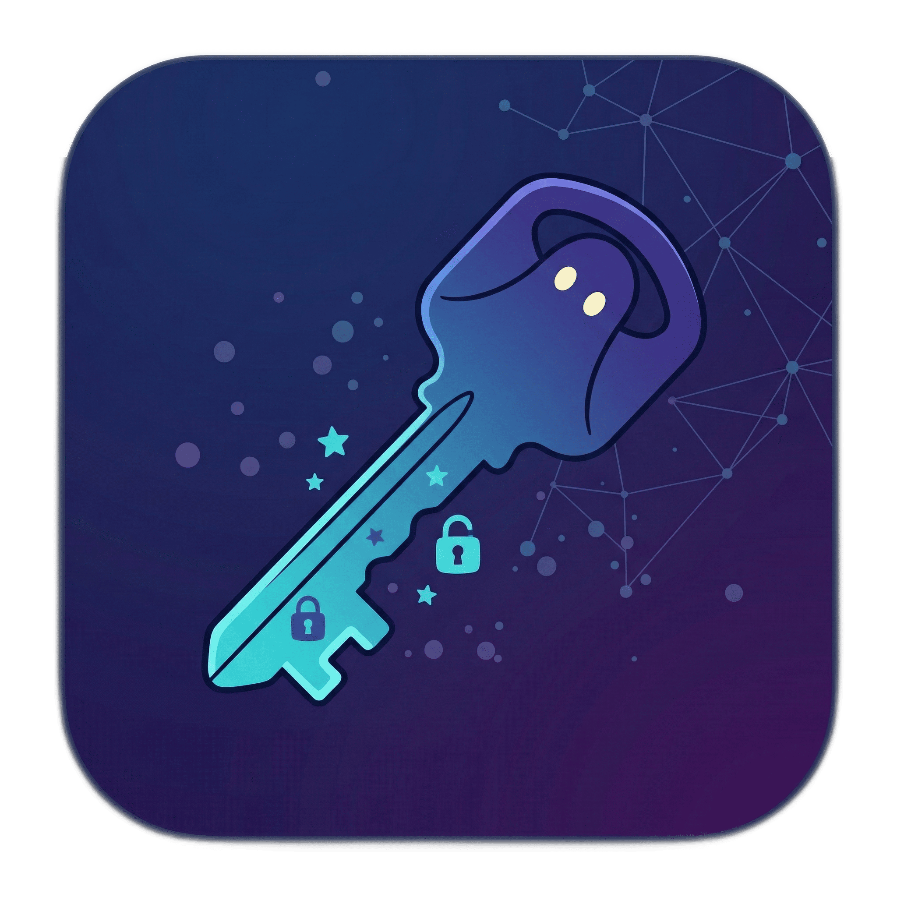
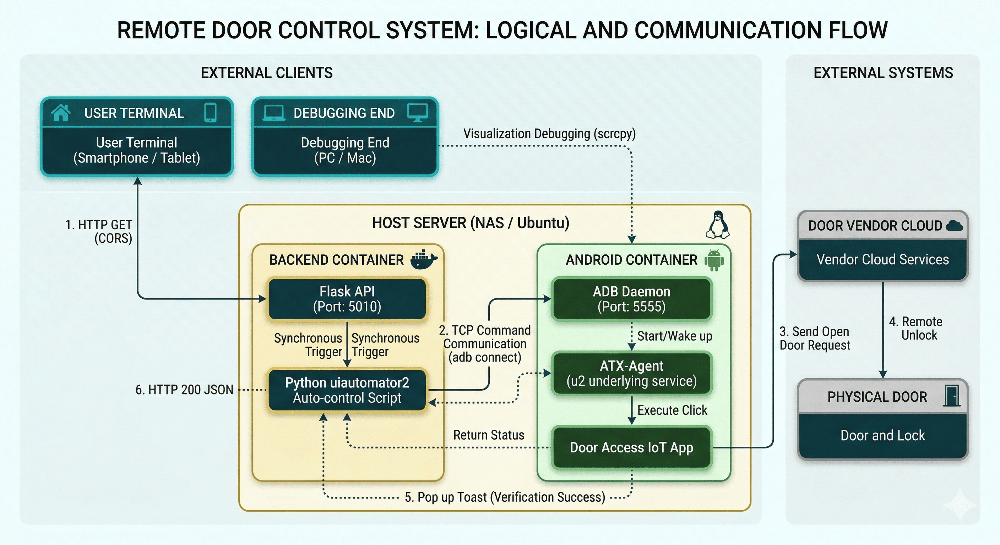
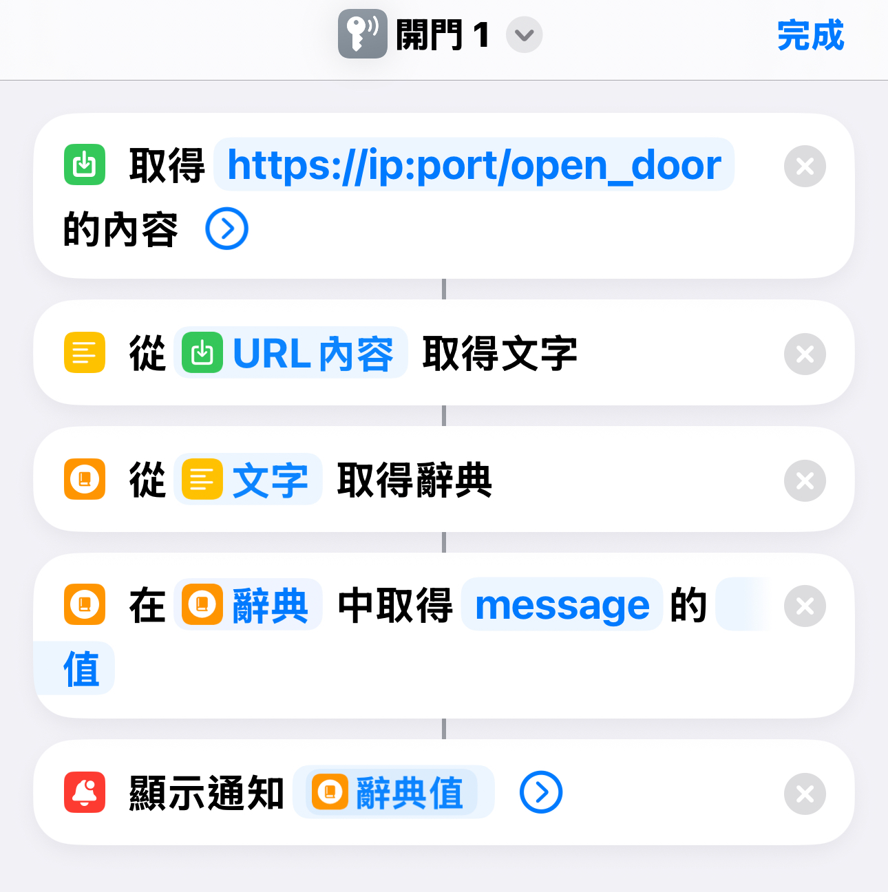

<div align="center">



# 👻 PhantomKey 🔑

### 一个简洁优雅的开源物联网门禁访问控制绕过方案

**专注于速度和易用性**

*支持 Linux, Synology NAS, fnOS, Docker, Windows, macOS*

[](https://github.com/yourusername/phantomkey/releases)
[](LICENSE)
[](https://github.com/yourusername/phantomkey/actions)
[](https://hub.docker.com/r/yourusername/phantomkey)
[](https://github.com/yourusername/phantomkey)


<!-- 
[🎯 动机](#动机) • [⚡ 功能](#功能) • [🏗️ 架构](#架构) • [📦 部署](#部署) • [❓ 常见问题](#常见问题) -->


🇺🇸 [English](README.md) | 🇨🇳 [汉语](README.zh-CN.md)
</div>


## ⏰ 重要提醒

**本仓库内容仅作为解决方案参考分享。不同的开锁App可能采用不同的实现方案，因此本仓库中的程序可能无法直接运行，需要根据实际情况进行修改。请注意，大概率不能直接使用！**


## 🎯 动机

传统的住宅或智能家居物联网门禁应用程序通常存在启动缓慢和步骤繁琐的问题。每次回家，或者甚至你在家需要给外卖员开门，你都需要：

> 📱 掏出手机 → 🔓 解锁屏幕 → 🔍 找到应用 → ⏳ 等待启动画面/广告 → 🏢 找到对应的楼栋 → 👆 点击开门

此外，许多物联网供应商的通信协议涉及**复杂的动态加密**和**硬件指纹识别**，使得直接 API 逆向工程成本高昂且容易失败。

### 解决方案：PhantomKey 🎯

**PhantomKey** 通过解决了这个问题：

1. 利用部署在本地网络服务器上的 **Android x86**（PVE 8.0为例，用Android容器应该也可以，不过未测试）
2. 在后台**持续运行门禁应用** （通过uiautomator2+Flask api，例如访问http://localhost:port/open_door 即可控制Android自动化开门）
3. 使用 **Python 脚本**实现精确的 **UI 自动点击**
4. 提供**极简化的网页仪表板**，实现真正的 **"一键秒开"**


## ⚡ 功能特性

| 功能 | 描述 |
|---------|-------------|
| 🚀 **终极速度** | 通过 Android 容器热启动绕过所有启动画面和广告 |
| 🔌 **协议无关** | 无需逆向工程加密 API；只要应用能运行，PhantomKey 就能控制它 |
| 🔄 **混合模式** | 支持"静默模式"和"稳健模式"（故障时自动重连和应用重启） |
| 🌐 **跨平台访问** | 完美适配 iOS 快捷指令、Safari 主屏应用和 Android 桌面小部件 |
| 👁️ **可视化调试** | 无缝支持 `scrcpy` 实时观察容器内应用的运行状态 |


## 🏗️ 架构

该方案采用**前后端分离设计**。核心业务逻辑在 Docker 容器内形成闭环运行。

### 系统架构图



### 关键组件

- **🐧 宿主服务器**：运行 Docker 的 NAS 或 Ubuntu 机器
- **🐳 后端容器**：Flask API + Python UI 自动化脚本
- **🤖 Android x86**：Android 环境，运行门禁应用
- **☁️ 云端服务**：物联网服务商的后端
- **🚪 物理门禁**：智能锁或门禁控制系统

```mermaid
  flowchart LR
    %% 定义节点样式
    classDef api fill:#4A90E2,stroke:#fff,stroke-width:2px,color:#fff;
    classDef check fill:#F5A623,stroke:#fff,stroke-width:2px,color:#fff;
    classDef action fill:#7ED321,stroke:#fff,stroke-width:2px,color:#fff;
    classDef error fill:#D0021B,stroke:#fff,stroke-width:2px,color:#fff;
    classDef device fill:#9013FE,stroke:#fff,stroke-width:2px,color:#fff;

    %% 1. API 触发阶段
    Start([前端请求 GET /open_door]) --> CheckLock{系统是否忙碌?}
    
    CheckLock -->|是| ReturnBusy[返回 JSON: 状态 busy]:::api
    CheckLock -->|否| StartThread[开启后台独立线程]:::api
    StartThread --> ReturnSuccess[立即返回 JSON: 指令已发送]:::api

    %% 2. 后台设备连接阶段
    subgraph BG["后台线程: 开门核心逻辑"]
        direction TB
        
        CheckADB{检查 ADB 状态}
        
        CheckADB -->|offline| ReconnectADB[执行 adb connect 重连]:::device
        CheckADB -->|online| CheckU2{检查 u2 对象<br/>是否存活}
        ReconnectADB --> CheckU2
        
        CheckU2 -->|失效| InitU2[重新初始化 u2.connect]:::device
        CheckU2 -->|存活| CheckApp{检查 App 状态}
        InitU2 --> CheckApp
        
        %% 3. UI 自动化操作阶段
        CheckApp -->|未运行| StartApp[热启动 App]:::action
        CheckApp -->|已前台| ClickTab[点击底部解锁 Tab]:::action
        StartApp --> ClickTab
        
        ClickTab --> ClickDoor[点击楼栋按钮]:::action
        
        ClickDoor -->|成功| SuccessLog([日志: 门已成功打开!]):::action
        ClickDoor -->|失败| FailLog([日志: 找不到按钮]):::error
    end
    
    ReturnSuccess -.异步执行.-> CheckADB
```





## 📦 部署指南

### ✅ 前置条件

- 支持 **Docker** 和 **虚拟机** 的宿主机（如 Ubuntu、Debian 或 Synology NAS）/ 或PVE虚拟机
- **Windows/macOS 调试环境**：安装 `adb` 和 `scrcpy`

---

### 📋 第一步：安装 Android x86

**1. 下载 Android x86**

从清华镜像下载 Android x86 ISO 文件：
[Android x86](https://mirrors.tuna.tsinghua.edu.cn/osdn/android-x86)

选择最新的稳定版本（如 `android-x86_64-9.0-r2.iso`）

**2. 创建虚拟机或 U 盘启动**

- 使用 PVE/VMware/VirtualBox/Synology Virtual Machine/fnOS虚拟机 创建虚拟机并装载 ISO
- 或刻录到 U 盘用真实机器启动
- 分配至少 2GB RAM 和 20GB 存储空间

**3. 安装 Android x86**

按照安装向导完成 Android x86 的安装

---

### 📋 第二步：安装 ARM 兼容库

Android x86 默认不支持 ARM 应用，需要安装 ARM 兼容层（Houdini）。

**下载安装 ARM 兼容库**

参考[这篇文章](https://foxi.buduanwang.vip/linux/1996.html/)安装ARM兼容库文件

`houdini9_y.sfs` 位于github目录的 `android_x86` 文件夹中


---

### 📋 第三步：准备门禁应用

**1. 在 Android x86 中安装门禁应用**

使用 `adb` 或应用市场安装你的门禁应用（如：小区门禁、楼宇对讲等）

**2. 登录并进入主界面**

- 打开应用并登录你的账户
- 导航到包含**开门按钮**的主界面
- **关键**：这个界面需要保持打开，后续自动化脚本会控制这个界面

**3. 找到 UI 元素信息**

使用 `uiautomatorviewer` 或 `weditor` 工具扫描应用界面，推荐使用`weditor`，通过pip安装，教程可参考[博客园文章](https://www.cnblogs.com/xiaodi888/p/19025687)

```python
pip install weditor
```

记录：
- 开门按钮的 `resourceId` 或 `text`
- 任何必要的导航按钮 ID

保存这些信息，后续配置时需要用到

---

### 📋 第四步：配置 ADB 连接

**1. 启用 Android x86 的 ADB**

在 Android x86 设置中：
- 进入 **开发者选项**
- 启用 **USB 调试**
- 启用 **ADB over Network**（网络 ADB）
- 记录显示的 IP 和端口（通常是 `192.168.x.x:5555`）

**2. 从 PC 连接**
```bash
adb connect 192.168.3.146:5555
adb devices
```

如果看到设备列表中出现你的 Android，说明连接成功

---

### 📋 第五步：部署后端 API（以群晖 NAS 为例）

**第 1 步：创建 Docker 容器**

在群晖 Docker 中创建一个 Ubuntu 容器：
```bash
docker run -d --name phantomkey-backend \
  -p 5010:5010 \
  -v /volume1/docker/phantomkey:/app \
  --restart unless-stopped \
  ubuntu:latest \
  sleep infinity
```

**第 2 步：上传应用文件**

1. 在群晖系统中创建文件夹：例如`/volume1/docker/phantomkey`
2. 将仓库中的以下文件上传到该文件夹：
   - `src/app.py`
   - `src/start.sh`

**第 3 步：编辑配置文件**

编辑 `app.py` 顶部的全局变量，填入你在**第三步**记录的 UI 元素信息：
```python
# Android x86 的 IP 和 ADB 端口
DEVICE_ADDR = "192.168.x.x:5555"

# 你的门禁应用的包名（例如：com.example.doorlock）
PACKAGE_NAME = 'com.yourvendor.iot'

# 开门按钮的 resourceId 或 text（从 weditor 获取）
UNLOCK_BUTTON_ID = "com.yourvendor.iot:id/unlock_btn"
# 或者
UNLOCK_BUTTON_TEXT = "开门"
```

**第 4 步：进入容器并运行**

在群晖 Docker 中进入 Ubuntu 容器的命令行，然后运行：
```bash
cd /app
apt-get update && apt-get install -y python3 python3-pip
chmod +x start.sh
./start.sh
```

容器将自动安装依赖并启动 Flask API 服务，监听端口 `5010`。

检查日志确保没有错误：
```bash
docker logs phantomkey-backend
```

---

### 🌐 第六步：部署前端网页界面

打开前端文件 (`index.html`)。修改 `API_URL` 变量，指向你新部署的后端服务地址：
```javascript
const API_URL = "http://YOUR_NAS_IP:5010/open_door";
```

**部署此 HTML 文件到：**
- 任何网络服务器（如 Nginx、GitHub Pages）
- 或直接保存在你的手机本地

💡 **专业提示：** 在 iOS Safari 或 Android Chrome 中打开该页面，然后在分享菜单中点击**添加到主屏幕**，可获得类似应用的体验。也可以用 iOS 的快捷指令，部署到 Action Button 上，非常好用。或者可以部署到Home assistant上绑定小米按钮之类的智能家居，通过API_URL做到很多自动化操作，在这就不一一列举。



---

### 🧪 测试连接

打开你的网页应用，点击"开门"按钮。如果一切正常，你应该看到：

1. Android x86 上的应用自动点击了开门按钮
2. 网页显示"开门成功"
3. 实际门禁打开

---

## ❓ 常见问题

### Q: 为什么不能直接用？

> **A:** 不同开锁APP有不同的开锁流程，不能完全适配所有APP。本仓库只提供一个自动化思路，如果有需要，可以通过AI的帮助修改代码。


### Q: 前端点击开门后一直转圈，最后显示"连接失败"？

> **A:** 请按 **F12**（或在手机上使用抓包工具）检查网络请求。
> 
> 确保：
> - `API_URL` 配置正确
> - 后端容器的端口 `5010` 允许通过防火墙
> - 后端服务正在运行：`docker ps`


### Q: 为什么有时点击开门后需要 5-8 秒才显示成功？

> **A:** 这是**正常现象**。这表示系统检测到热启动失败，触发了冷启动（**稳健模式**）。
> 
> 系统自动在：
> - 后台重启应用
> - 重新建立 ADB 连接
> - 确保最终成功开启门禁

### Q: 我可以用这个控制多个门禁/楼栋吗？

> **A:** 可以！你可以：
> - 为不同的应用创建多个 Flask API 端点
> - 部署多个 Android 容器，各运行不同的应用/或一个Android 容器安装多个应用
> - 创建统一的网页仪表板，为每个位置添加按钮
> - 需要你有一定的编程及修改程序能力

### Q: 这个方案安全吗？

> **A:** 因为 PhantomKey 在**本地网络**上与 Android 容器通信：
> - 它**不会暴露**物联网供应商的 API
> - 它使用官方供应商应用（你不是在逆向工程）
> - 通信完全局限在你的本地网络内
> 
> **最佳实践：** 如果远程访问，请使用 VPN 或其他网络安全措施。

---

## 📄 许可证

[Apache License 2.0](../../LICENSE)


</div>
